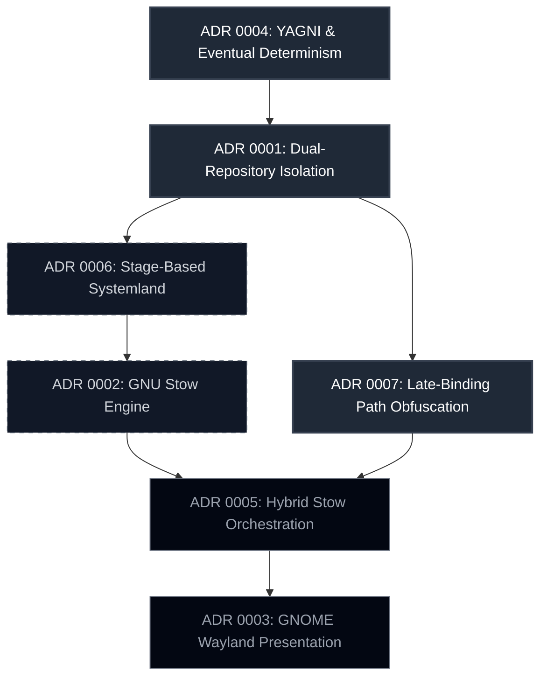

# Architecture Decision Records

This directory contains the chronological log of architectural decisions governing the `workstation-core` provisioning lifecycle.

## Decision Dependency Graph

The diagram below illustrates the logical hierarchy and conceptual dependencies of the decisions. Foundational principles dictate provisioning mechanics, which in turn support presentation layer configurations.

## ADR Index

| ID | Decision | Date | Status | Core Impact |
| :--- | :--- | :--- | :--- | :--- |
| [0001](0001-dual-repository-state-isolation.md) | Dual-Repository State Isolation | 2026-07-11 | Accepted | Establishes the boundary between public core and private overlay. |
| [0002](0002-provisioning-engine-stow.md) | GNU Stow Provisioning Engine | 2026-07-11 | Accepted | Adopts symlinking for zero-dependency user configuration. |
| [0003](0003-presentation-layer-wayland.md) | GNOME Wayland Presentation Layer | 2026-07-11 | Accepted | Defers raw Tiling Window Managers in favor of stable hardware integration. |
| [0004](0004-eventual-determinism-via-yagni.md) | Friction-Driven YAGNI | 2026-07-12 | Accepted | Restricts configuration mapping strictly to elements causing workflow friction. |
| [0005](0005-tiered-stow-orchestration.md) | Hybrid Stow Orchestration | 2026-07-12 | Accepted | Combines atomic directories with Make target orchestration. |
| [0006](0006-stage-based-systemland-provisioning.md) | Stage-Based Systemland | 2026-07-15 | Accepted | Separates unprivileged user symlinks from elevated root operations. |
| [0007](0007-late-binding-path-obfuscation.md) | Late-Binding Path Obfuscation | 2026-07-16 | Accepted | Decouples private path structures and enforces anonymous naming. |
